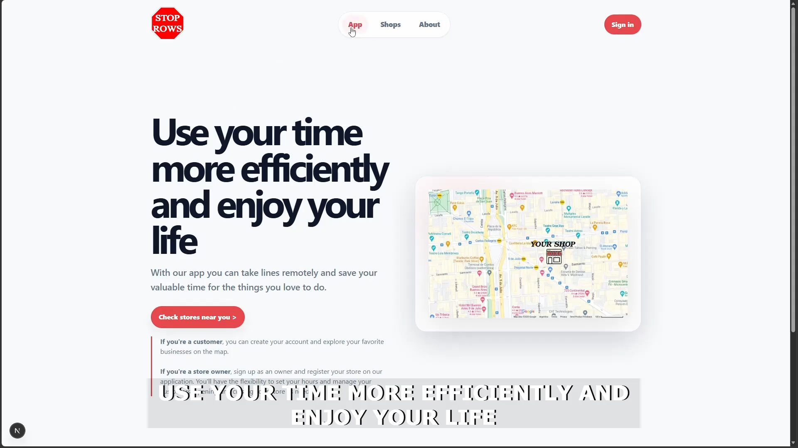
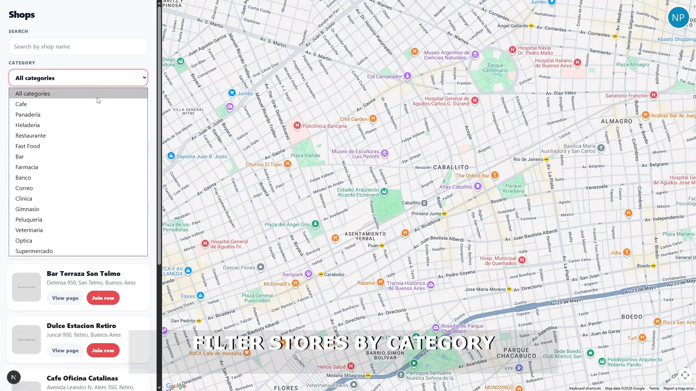
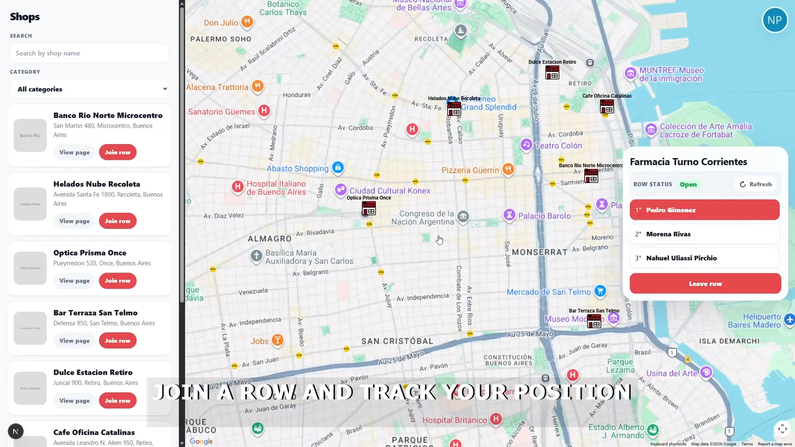
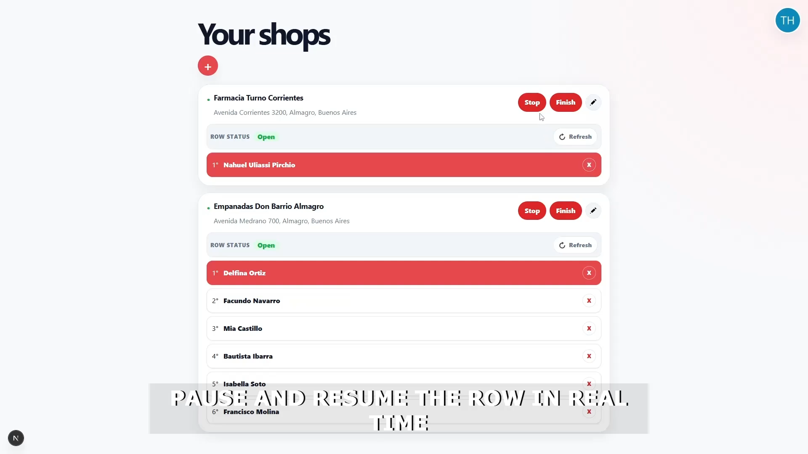
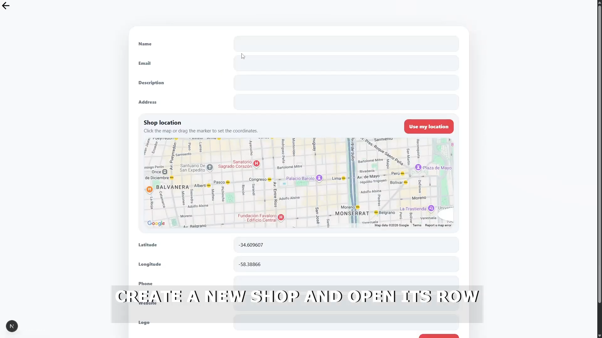

# Stop Rows

> Skip the wait — join any shop's queue remotely, from anywhere.

## 📖 About

Stop Rows is a remote queue management system born from a simple frustration: spending too much time sitting in line at the bank. The app lets customers browse nearby shops on a map, join their queues remotely, and track their position in real time — while shop owners get a dedicated dashboard to manage their queues and store listings. The backend is built with TypeScript and includes a caching layer for frequently accessed resources like shops and categories.

## ✨ Features

- 🗺 **Interactive map** — browse shops by location using Google Maps; find what's near you at a glance
- ♾️ **Infinite scroll** — shop list loads progressively via IntersectionObserver for a smooth browsing experience
- 🔢 **Live queue view** — see the current queue for any shop in real time; owners can remove users from the list
- 🔐 **JWT authentication** — login, signup, and logout backed by cookies; implements refresh token rotation
- 🏪 **Shop management** — owners can create, edit, and delete their shops through a shared reusable form
- 📄 **Server-side rendered shop pages** — each shop page fetches data on the server for fast initial loads
- 🛎 **Server status banner** — notifies users when the backend is waking up from a cold start

---

## 🛠 Tech Stack

| Category | Technology |
|----------|-----------|
| Framework | Next.js 15 (Pages Router) |
| Language | TypeScript |
| Styling | CSS Modules |
| Maps | Google Maps API (`@react-google-maps/api`) |
| Auth | JWT in cookies + refresh tokens (`js-cookie`) |
| Deployment | Vercel |

---

## 🚀 Getting Started

### Prerequisites

- Node.js 24.x or higher

### Installation

```bash
git clone https://github.com/NahuelUliassiPirchio/nextjs-stop-rows-frontend.git
cd nextjs-stop-rows-frontend
npm install
cp .env .env.local   # fill in your values
```

---

## ⚙️ Environment Variables

| Variable | Description | Required |
|----------|-------------|----------|
| `API_URL` | Base URL of the Stop Rows backend API | ✅ |

---

## 📁 Project Structure

```
├── pages/
│   ├── index.tsx         # Landing / home
│   ├── login.tsx
│   ├── signup.tsx
│   ├── profile.tsx
│   ├── new-shop.tsx
│   ├── shops/[id].tsx    # SSR shop detail page
│   └── app/index.tsx     # Authenticated app shell
├── components/           # Reusable UI components
├── hooks/                # Custom hooks (useAuth, useShops, useServerStatus…)
├── services/             # API service layer (auth, shops, rows, categories)
├── common/               # Shared types and endpoint constants
└── styles/               # CSS Modules per component
```

---

## 🖥 Usage

**Development**
```bash
npm run dev
```

**Production build**
```bash
npm run build
npm run start
```

**Lint**
```bash
npm run lint
```

---

## 📸 Screenshots

| Landing | Categories |
|--------|------------|
|  |  |

| Customer in queue | Owner — your shops |
|------------------|--------------------|
|  |  |

| New shop form |
|---------------|
|  |

---

## 🌐 Live Demo

[https://nextjs-stop-rows-frontend.vercel.app/](https://nextjs-stop-rows-frontend.vercel.app/)

---

## 👤 Author

**Nahuel Uliassi Pirchio**

- 🌐 [uliassipirchio.me](https://uliassipirchio.me)
- 💼 [LinkedIn](https://linkedin.com/in/uliassipirchio)
- 🐙 [GitHub](https://github.com/NahuelUliassiPirchio)
